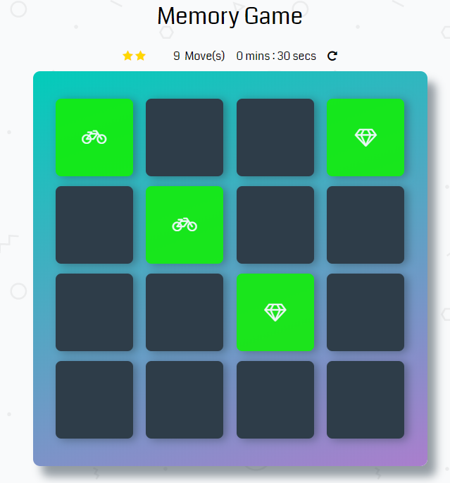

# Memory Game Project
This is a simple game built. There's a deck of cards with different icons. 

## Challenge
Match cards in less time with less moves.

## How to Play
Load this link in your browser http://mohamed-ramadan.comeze.com/fend-project-memory-game-master/index.html

## Instructions
* Click on a card
* Keep revealing cards and working your memory to remember each unveiled card.
* Match cards properly with less moves and in faster time

## How I built the Memory Game
* created a deck of cards that shuffles when game is refreshed
* created a counter to count the number of moves made by player and timer to know the duration of a play
* added effects to cards when they match and are unmatched
* create a pop-up modal when player wins game

## Resources
* https://developer.mozilla.org
* Validate HTML and CSS https://validator.w3.org
* Validate JS syntax code http://esprima.org/demo/validate.html
* Search about solutions of problems https://stackoverflow.com 

## Contributing

This repository is the starter code for _all_ Udacity students. Therefore, we most likely will not accept pull requests.

For details, check out [CONTRIBUTING.md](CONTRIBUTING.md).
